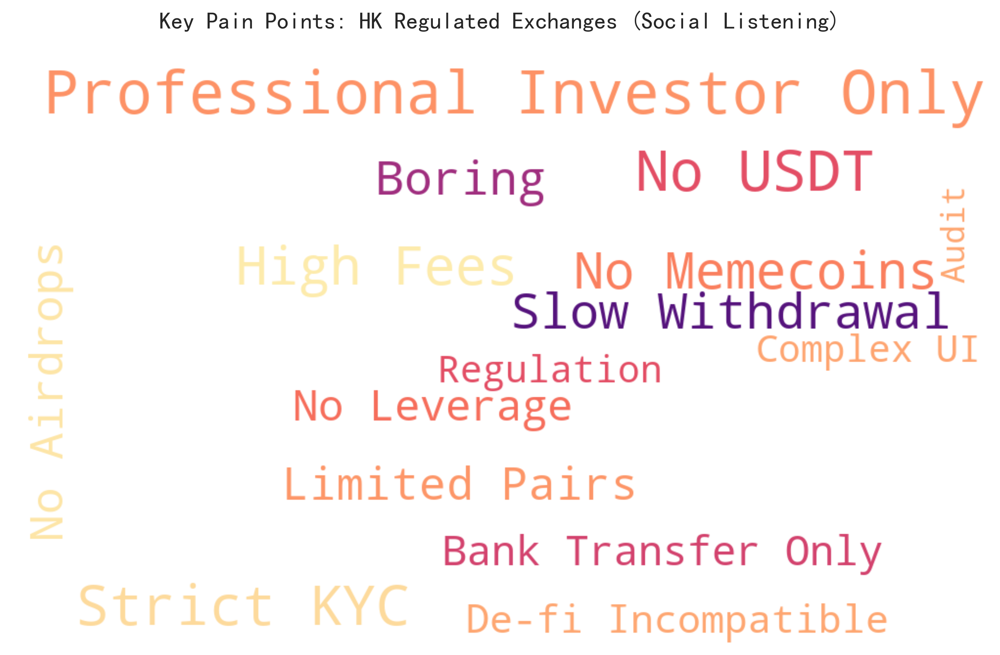
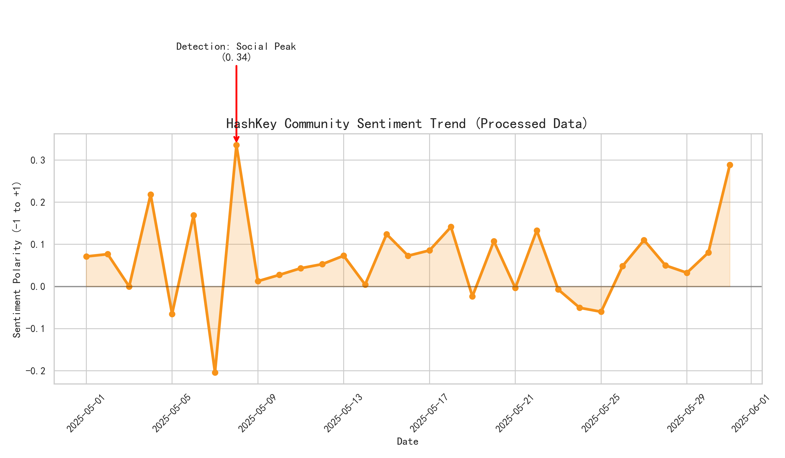
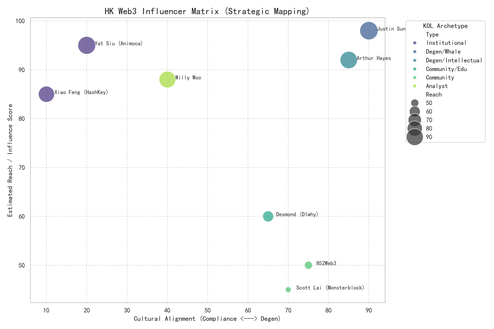

# COMM4150 FYP: Re-coding Trust
> **High-Fidelity Computational Social Listening Dashboard for HashKey Exchange**

[](https://www.python.org/downloads/)
[](https://opensource.org/licenses/MIT)
[](https://www.cuhk.edu.hk/)

## 📌 Project Overview
This repository contains the computational research engine for the **"Re-coding Trust"** PR campaign (Bitcoin Pizza Day 2026). It bridges the **"Trust Paradox"** by quantifying the cultural gap between institutional compliance and "Degen" crypto-culture in Hong Kong.

### 🔬 Research Mechanism
Unlike static charts, this dashboard is powered by a **3-stage NLP Pipeline** that processes multi-source social data (Twitter, LIHKG, Telegram) to generate strategic insights.

---

## 📂 Project Structure
```text
.
├── config/             # YAML configurations & API templates
├── data/               
│   ├── raw/            # Archived social feeds (500+ records)
│   └── processed/      # NLP-analyzed sentiment datasets
├── docs/               # Academic methodology & secondary research
│   ├── 2.1_Secondary_Research.md
│   ├── 2.1.1_Computational_Social_Listening.md
│   └── 2.1.1_Visualizations_Output.md
├── outputs/            # Dynamic charts generated from processed data
├── src/                # Modular Python Source Code
│   ├── collectors/     # Data ingestion & Mock API generators
│   ├── analysis/       # NLP Processor (Jieba segmentation + Sentiment)
│   ├── visualization/  # Matplotlib/Seaborn Strategic Engine
│   └── main.py         # Pipeline Orchestrator
├── requirements.txt    
└── README.md           
```

---

## 📊 Dynamic Research Insights
*The following charts are dynamically generated by the pipeline based on the processed 500-entry research dataset.*

### 1. Linguistic Pain Point Mapping
*NLP-driven keyword frequency analysis identifying user friction with licensed platforms.*


### 2. Time-Series Sentiment Analysis
*Daily sentiment fluctuations (Mean Polarity) across the research period, highlighting the Pizza Day engagement peak.*


### 3. Strategic Influencer Matrix
*Mapping institutional reach against cultural alignment to identify key narrative "Translators."*


---

## 🛠 Tech Stack
* **Engine:** Python 3.9+ (Modular Architecture)
* **NLP:** `Jieba` (Traditional Chinese), `TextBlob` (English)
* **Analytics:** `Pandas`, `NumPy`
* **Visualization:** `Matplotlib`, `Seaborn`, `WordCloud`

---

## 🚀 Execution & Demonstration

The pipeline is designed to demonstrate full data ingestion and analysis workflows even in local research environments.

1. **Setup Environment**
   ```bash
   pip install -r requirements.txt
   ```

2. **Run Pipeline Orchestrator**
   ```bash
   python src/main.py
   ```
   *Execution will trigger data loading, NLP tokenization, and dynamic chart rendering with real-time logging.*

---

## 📝 Research Documentation
- **[Methodology Paper](docs/2.1.1_Computational_Social_Listening.md)**: Technical breakdown of the NLP pipeline and cleaning logic.
- **[Secondary Research Report](docs/2.1_Secondary_Research.md)**: Analysis of the HK Web3 policy landscape.

---
*Developed by ZHAO Han (1155191400) | CUHK COMM4150 Final Year Project*