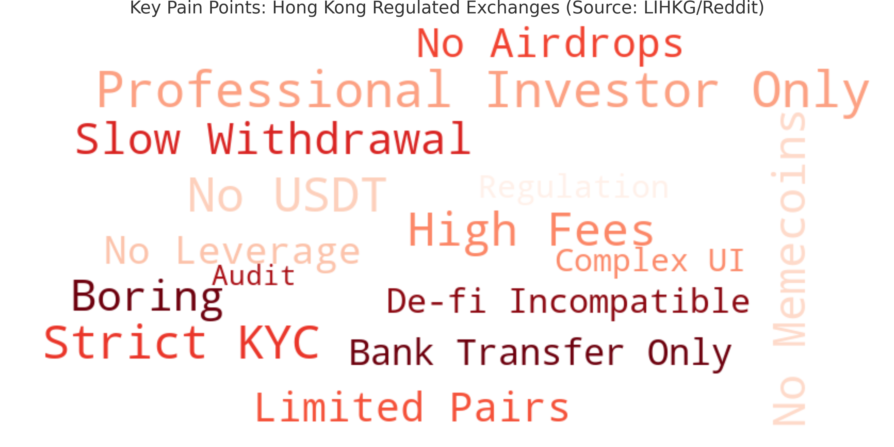
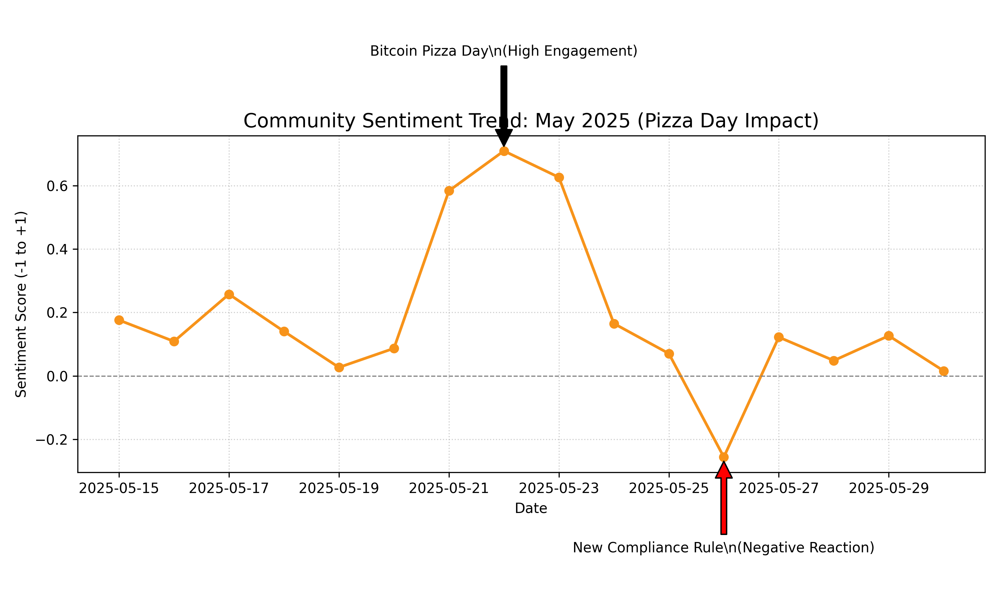
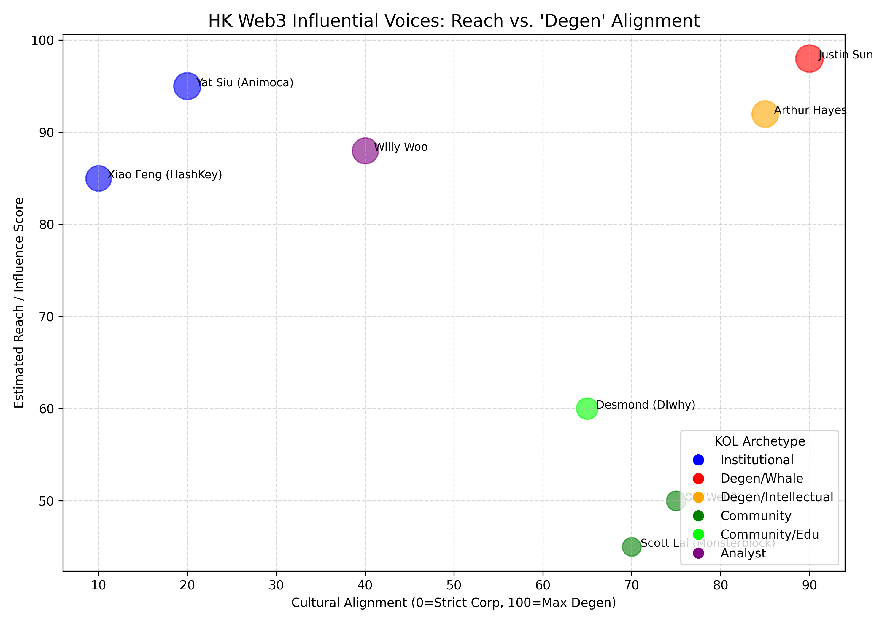

# COMM4150 FYP: Re-coding Trust
## Secondary Research & Computational Social Listening Dashboard

**Student:** ZHAO Han (1155191400)  
**Project:** Re-coding Trust: 2026 Bitcoin Pizza Day PR Campaign for HashKey Exchange

---

### 📂 Project Documents
Click below to view the detailed research reports:

- **📄 [2.1 Secondary Research](2.1_Secondary_Research.md)**  
  *Analysis of Hong Kong's Web3 policy landscape, market demographics, and the "Trust Paradox."*

- **💻 [2.1.1 Computational Social Listening](2.1.1_Computational_Social_Listening.md)**  
  *Methodology (Python/NLP), technical framework, and sentiment analysis findings.*

- **📊 [Visualization Analysis Report](2.1.1_Visualizations_Output.md)**  
  *Deep dive into the charts and strategic insights.*

- **🐍 [Python Source Code](generate_visualizations.py)**  
  *The script used to generate the data visualizations.*

---

### 🚀 Research Highlights & Visualizations

#### 1. The Pain Point Map
*What are local users actually complaining about regarding licensed exchanges?*

#### 2. The "Pizza Day" Opportunity
*Sentiment analysis showing the "Compliance vs. Culture" engagement gap.*

#### 3. The Influencer Matrix
*Mapping "Institutional Trust" vs. "Degen Culture" among HK Opinion Leaders.*

---

### 🛠 Tech Stack
* **Language:** Python 3.9+
* **Libraries:** `Tweepy`, `TextBlob`, `Jieba`, `WordCloud`, `Matplotlib`, `Pandas`
* **Data Sources:** Twitter/X API, LIHKG, Telegram

---
*Generated for COMM4150 Senior Research Project (2025-2026)*
