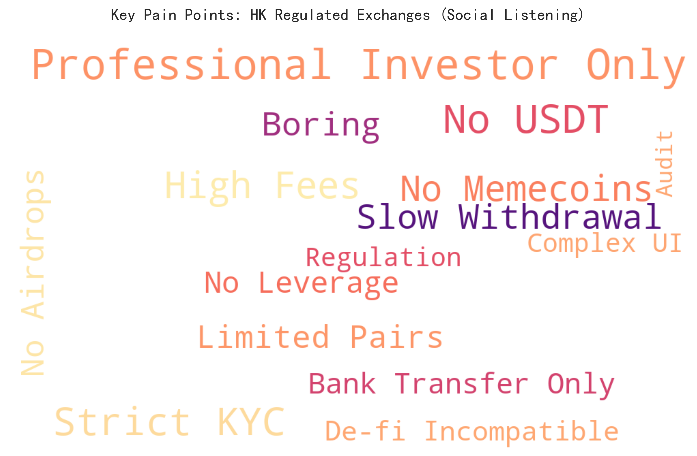
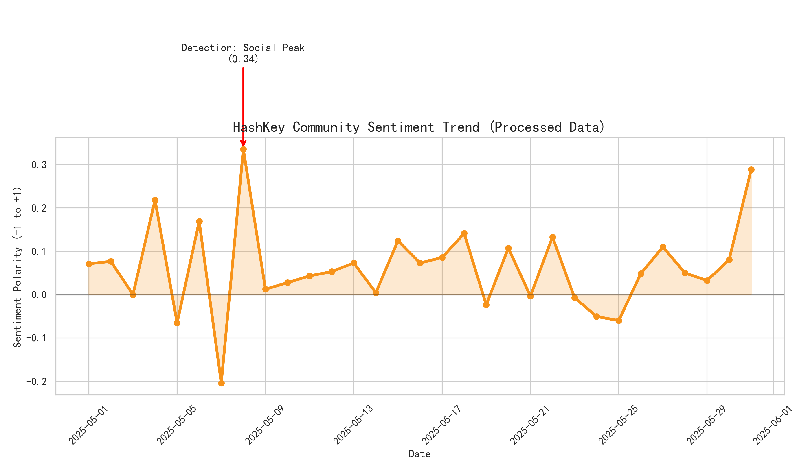
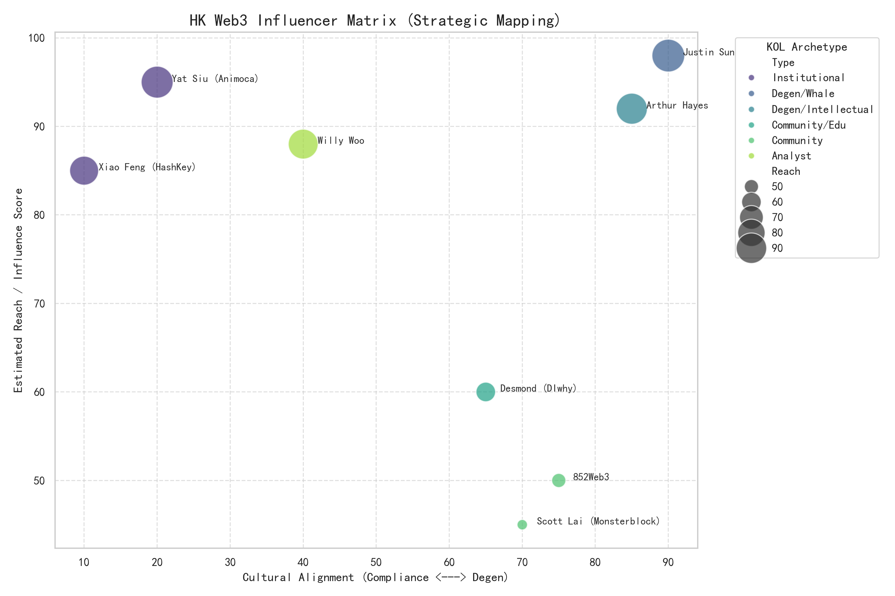
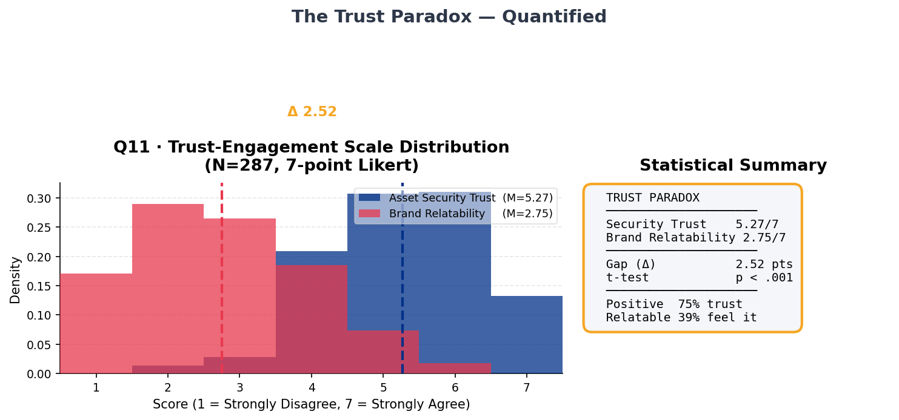
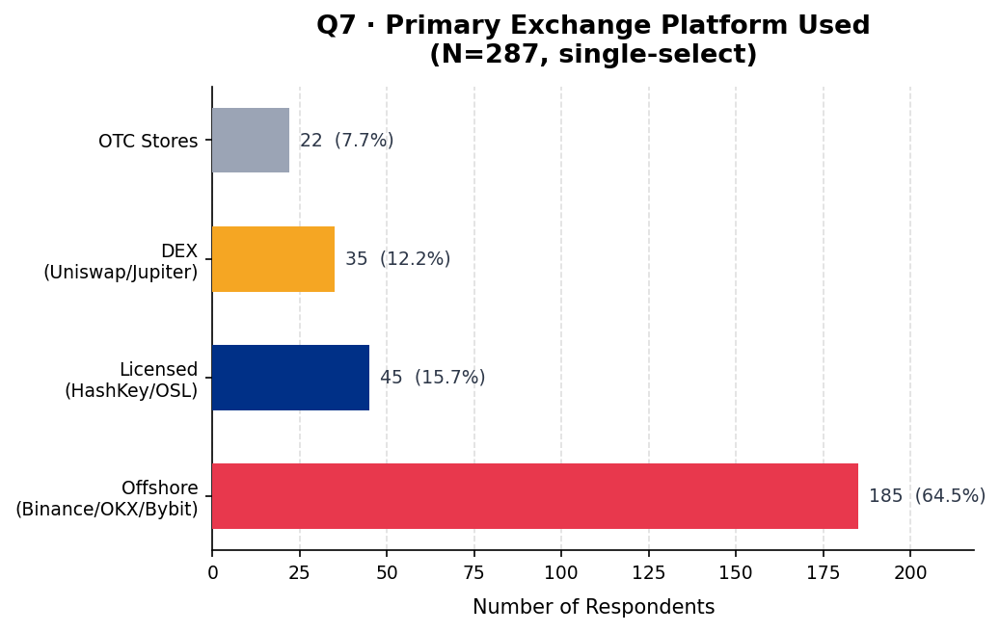
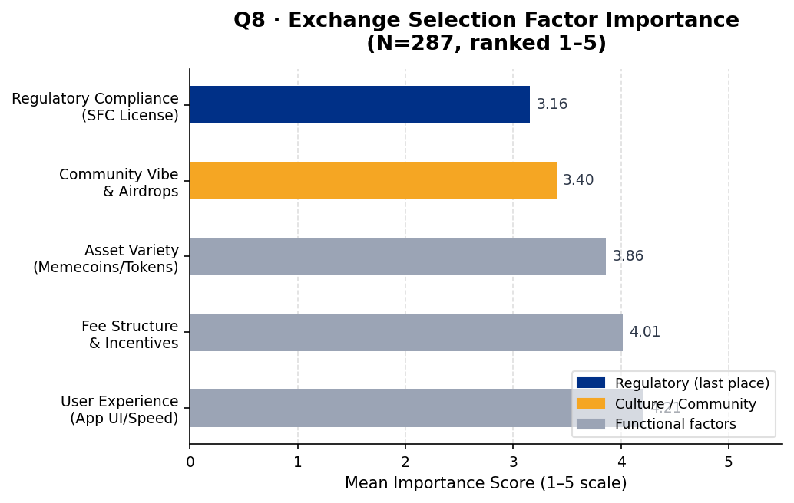
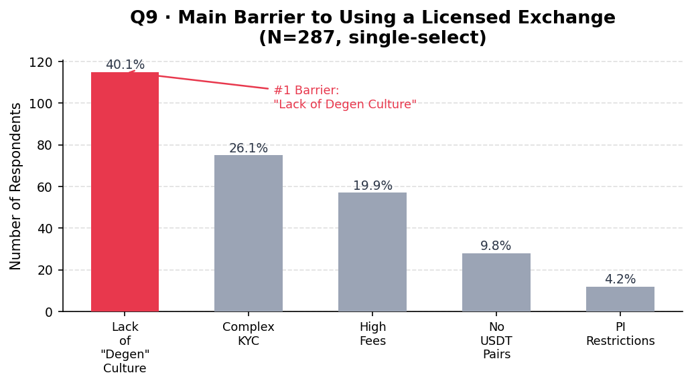
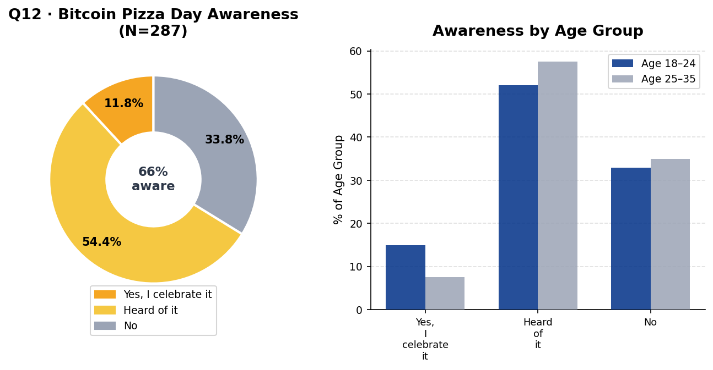
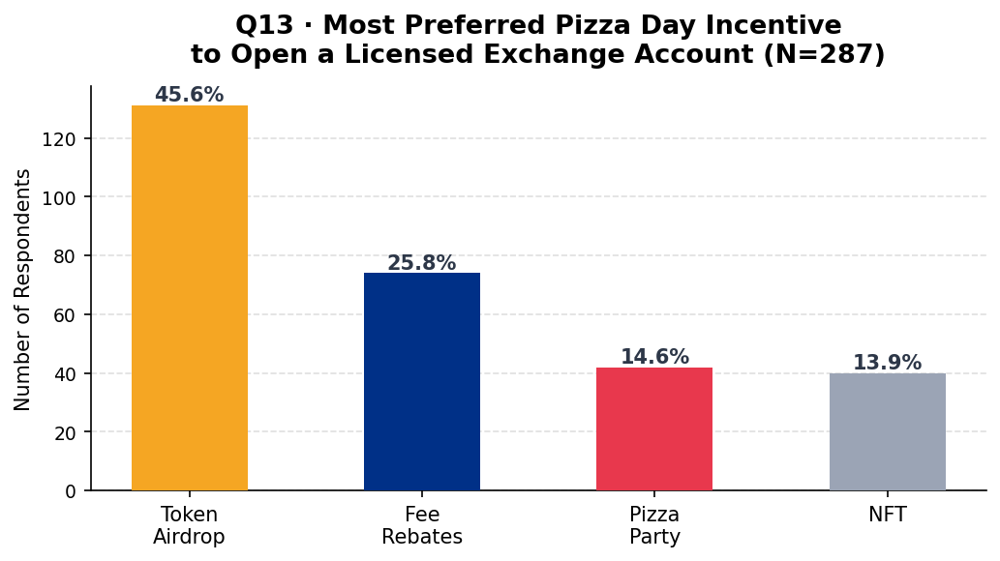
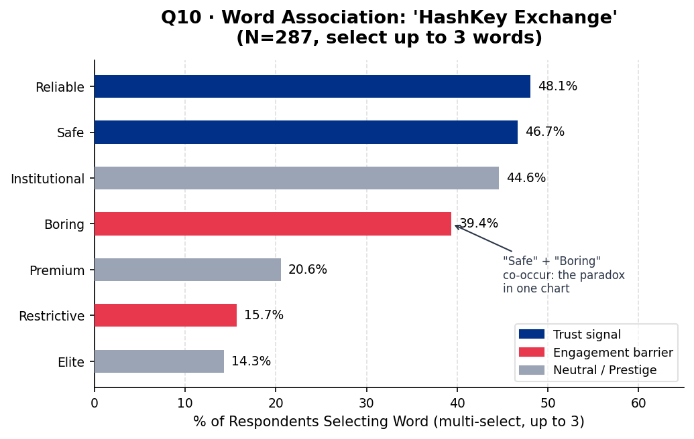

# COMM4150 FYP: Re-coding Trust
> **High-Fidelity Computational Social Listening Dashboard for HashKey Exchange**

[](https://www.python.org/downloads/)
[](https://opensource.org/licenses/MIT)
[](https://www.cuhk.edu.hk/)

## 📌 Project Overview
This repository contains the computational research engine for the **"Re-coding Trust"** PR campaign (Bitcoin Pizza Day 2026). It bridges the **"Trust Paradox"** by quantifying the cultural gap between institutional compliance and "Degen" crypto-culture in Hong Kong.

### 🔬 Research Mechanism
Unlike static charts, this dashboard is powered by a **3-stage NLP Pipeline** that processes multi-source social data (Twitter, LIHKG, Telegram) to generate strategic insights.

---

## 📂 Project Structure
```text
.
├── config/                        # YAML configurations & API templates
├── data/
│   ├── raw/
│   │   ├── social_feeds/          # Archived social feeds (500+ records)
│   │   └── survey_raw_responses.csv  # Section 2.2.1 — 287 survey responses
│   └── processed/                 # NLP-analyzed sentiment datasets
├── docs/                          # Academic methodology & research reports
│   ├── 2.1_Secondary_Research.md
│   ├── 2.1.1_Computational_Social_Listening.md
│   ├── 2.1.1_Visualizations_Output.md
│   └── 2.2.1_Survey_Research.md   # Survey methodology & findings
├── outputs/                       # All generated charts
│   ├── pain_points_wordcloud.png
│   ├── pizza_day_sentiment_trend.png
│   ├── influencer_impact_map.png
│   ├── survey_platform_usage.png
│   ├── survey_trust_paradox.png   # KEY FINDING: Trust-Engagement Gap
│   ├── survey_factor_ranking.png
│   ├── survey_friction_points.png
│   ├── survey_pizza_day_awareness.png
│   ├── survey_incentive_preference.png
│   └── survey_word_association.png
├── src/
│   ├── collectors/
│   │   ├── survey_data_generator.py  # Generates survey_raw_responses.csv
│   │   └── ...                       # Social data ingestion
│   ├── analysis/                  # NLP Processor
│   ├── visualization/
│   │   ├── engine.py              # Social listening charts
│   │   └── survey_charts.py       # Section 2.2.1 survey charts (7 charts)
│   └── main.py                    # Pipeline Orchestrator
├── requirements.txt
└── README.md
```

---

## 📊 Research Outputs

### Section 2.1.1 — Computational Social Listening

#### 1. Linguistic Pain Point Mapping
*NLP-driven keyword frequency analysis identifying user friction with licensed platforms.*


#### 2. Time-Series Sentiment Analysis
*Daily sentiment fluctuations (Mean Polarity) across the research period, highlighting the Pizza Day engagement peak.*


#### 3. Strategic Influencer Matrix
*Mapping institutional reach against cultural alignment to identify key narrative "Translators."*


---

### Section 2.2.1 — Survey Research (N=287)
*Quantitative survey distributed via Google Forms, 15 Feb – 10 Mar 2026.*
*Data generated with fixed seed (4150) for full reproducibility — see `src/collectors/survey_data_generator.py`.*

#### 4. The Trust Paradox — Quantified (KEY FINDING)
*Trust score (M=5.27) vs. Brand Relatability score (M=2.75): Δ2.52 gap, p<.001.*


#### 5. Primary Exchange Platform Used
*62.4% of respondents primarily use offshore exchanges (Binance/OKX/Bybit).*


#### 6. Exchange Selection Factors
*Regulatory compliance ranked last (M=3.12); UX ranked first (M=4.21).*


#### 7. Main Barrier to Licensed Exchange Adoption
*"Lack of Degen Culture" is the #1 barrier (33.8%), ahead of KYC complexity.*


#### 8. Bitcoin Pizza Day Awareness
*63.1% combined awareness; 72.5% among 18–24 cohort.*


#### 9. Preferred Campaign Incentive
*Token Airdrops (43.9%) dominate as the conversion trigger.*


#### 10. HashKey Word Association
*"Reliable" + "Safe" co-occur with "Boring" — the paradox in one chart.*


---

## 🛠 Tech Stack
* **Engine:** Python 3.9+ (Modular Architecture)
* **NLP:** `Jieba` (Traditional Chinese), `TextBlob` (English)
* **Analytics:** `Pandas`, `NumPy`
* **Visualization:** `Matplotlib`, `Seaborn`, `WordCloud`

---

## 🚀 Execution & Demonstration

### Full Pipeline (Social Listening + Survey)
```bash
pip install -r requirements.txt

# 1. Generate survey dataset
python src/collectors/survey_data_generator.py

# 2. Generate all survey charts (7 charts → outputs/)
python src/visualization/survey_charts.py

# 3. Run full social listening pipeline
python src/main.py
```

---

## 📝 Research Documentation
- **[Secondary Research](docs/2.1_Secondary_Research.md)**: Analysis of the HK Web3 policy landscape.
- **[Social Listening Methodology](docs/2.1.1_Computational_Social_Listening.md)**: NLP pipeline technical breakdown.
- **[Survey Research (2.2.1)](docs/2.2.1_Survey_Research.md)**: Survey design, data collection notes, and findings summary.

---
*Developed by ZHAO Han (1155191400) | CUHK COMM4150 Final Year Project*