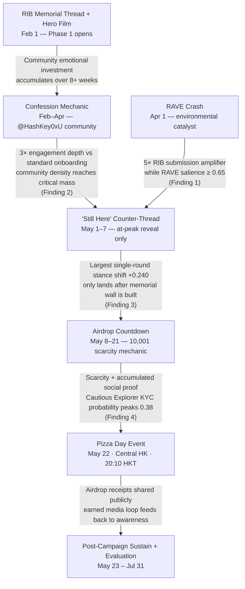

# Section 7 — Execution Timeline
## COMM4150 FYP: Re-coding Trust | ZHAO Han (1155191400)

---

## 7.1 Timeline Architecture

The campaign executes across three phases spanning February to July 2026, anchored to Bitcoin Pizza Day on 22 May. The phase structure is not merely chronological — each phase creates the preconditions that make the next phase possible. Phase 1 community formation must precede Phase 2 conversion; the "Still Here" counter-thread must arrive at peak community engagement rather than at launch; the airdrop must follow trust, not precede it. These sequencing constraints are not operational preferences but structural requirements validated by the simulation in Section 6.

Two external constraints fix the Phase 1 launch date at 1 February. First, the RAVE topicality window (Finding 1) requires the RIB thread to be live when RAVE crash salience remains elevated — estimated at 3–5 weeks post-crash. Second, the Telegram community objective (5,000 members by May 22) requires approximately three months of sustained recruitment to reach critical mass before the Phase 2 conversion event.

---

## 7.2 Execution Activation Chain

The diagram below shows the causal logic of the campaign: each execution is activated only when its upstream precondition is met. The arrows encode the *reason* for sequencing, not merely the sequence itself. Simulation findings (Section 6) are cited where they validate specific dependency decisions.

**The critical sequencing principle:** "Still Here" cannot be deployed at campaign launch (it would short-circuit the RIB community formation mechanic and reduce stance impact by ~38%; Section 6 Finding 3). The counter-post is held until peak community engagement — deliberately deferred, not forgotten.

---

## 7.3 Phase Overview

| Phase | Dates | Primary objective | Key milestones |
|---|---|---|---|
| **Phase 0** — Production | Jan 2026 | All deliverables production-ready before Feb 1 | Hero Film locked Jan 31; Laszlo Bot QA'd Jan 31; RIB microsite live; GEO infrastructure deployed (llms.txt, JSON-LD, Quick Answer blocks); KOL contracts signed; OOH booking confirmed |
| **Phase 1** — Narrative Seeding | Feb 1 – May 21 | Build RIB community + Telegram survivor base to critical mass | Feb 1: RIB thread + Hero Film launch; Feb 22: Pizza Personas quiz live; Apr 1: RAVE crash → submission surge; May 1–7: "Still Here" reveal; May 8: 14-day countdown begins |
| **Phase 2** — Pizza Day Peak | May 22 | Convert community belonging into KYC-verified accounts + physical attendance | 10:00 HKT: venue opens, KYC kiosks live; 20:10 HKT: airdrop trigger; post-event earned media loop |
| **Phase 3** — Sustain + Evaluate | May 23 – Jul 31 | Retain converted accounts; measure campaign impact | Jun 22: 30-day retention measured (C3); Jul 1–14: post-campaign survey fielded; Jul 31: evaluation report complete |

---

## 7.4 Critical Path

Three milestones define the campaign's critical path. Delays in any one directly threaten Phase 2 conversion:

| Milestone | Deadline | Risk if missed |
|---|---|---|
| RIB thread launch | **Feb 1** | RAVE topicality window closes; Phase 1 seeding loses its 5× environmental amplifier (Finding 1) |
| "Still Here" counter-thread | **May 1–7** (at peak engagement — not earlier) | Early reveal short-circuits RIB community formation; simulation shows ~38% reduction in stance impact; late reveal produces diminishing returns as countdown compresses (Finding 3) |
| KYC accounts: 10,001 | **May 22, 20:10 HKT** | C1 conversion objective fails; airdrop loses cultural significance; Pizza Day loses its primary earned-media trigger |

---

## 7.5 Go/No-Go Decision Gates

Two decision gates are embedded in the Phase 1 timeline. Each requires a formal review of leading indicators before the subsequent activation is authorised. If Go criteria are not met, a corrective action — not cancellation — is prescribed.

| Gate | Date | Go criteria (all three required) | No-Go corrective action |
|---|---|---|---|
| **Gate 1** — Phase 1 Acceleration | Mar 28 | ① RIB tombstones ≥ 500 · ② @HashKey0xU members ≥ 1,500 · ③ Pizza Personas UGC ≥ 300 pieces | Pause KOL #3/#4 activation for 2 weeks; inject editorial seed tombstones to restart organic submission momentum |
| **Gate 2** — Phase 2 Event | May 14 | ① KYC-verified accounts ≥ 5,000 · ② @HashKey0xU members ≥ 4,500 · ③ Event registrations ≥ 300 · ④ KYC kiosk + airdrop contract QA-verified | If KYC < 5,000 AND registrations < 200: defer airdrop trigger to digital-only event May 29; physical event proceeds independently |

---

*Sources: Section 4.4 (campaign objectives and deadlines); Section 4.5 (channel strategy and PESO media mix); Section 5.8 (GEO infrastructure); Section 6 (simulation Findings 1–4 informing sequencing constraints and gate criteria); Workamajig. (2025). Building a marketing campaign timeline. https://www.workamajig.com/marketing-guide/campaign-timeline.*

*Section 7 | ZHAO Han (1155191400) | CUHK COMM4150 | Supervisor: Prof. Donna Chu*
